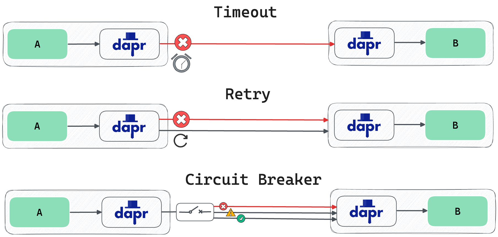

# Dapr Resiliency Example

## Overview
This project demonstrates how to use Dapr resiliency policies with Conductor Resiliency Builder feature.
For a detailed write-up, see this blog post: [Fault-Tolerant Microservices Made Easy with Dapr Resiliency](https://www.diagrid.io/blog/fault-tolerant-microservices-made-easy-with-dapr-resiliency).



## Prerequisites

- [Docker](https://www.docker.com/get-started)
- [Kubernetes](https://kubernetes.io/docs/setup/)
- [Dapr](https://docs.dapr.io/getting-started/install-dapr-cli/)
- [Skaffold](https://skaffold.dev/docs/install/)
- [Hey](https://github.com/rakyll/hey)
- [Diagrid Conductor](https://www.diagrid.io/conductor)

## Building the Applications

```bash
mvn clean package
```

## Running with Kubernetes and Skaffold

### Install Kubernetes, Dapr 1.14, and Diagrid Conductor (optional)
Follow the steps in the [quickstart guide](https://docs.diagrid.io/conductor/getting-started/quickstart/) to install Kubernetes and Conductor.

### Install Skaffold and Hey
To install Skaffold, use the following command:
```bash
brew install skaffold
brew install hey
```

### Deploy the Application
To deploy the applications to a Kubernetes cluster:

```bash
skaffold dev
```

## Demo Scenario

### Fast Response

```bash
hey -n 100 -c 10 -m POST -d '{"orderId": "200"}' -H "Content-Type: application/json" http://localhost:5001/checkout

Total:  0.2 secs
[200]   100 responses
```

### Slow Response

```bash
hey -n 100 -c 10 -m POST -d '{"orderId": "10"}' -H "Content-Type: application/json" http://localhost:5001/checkout

Total:  30.1844 secs
[200]   100 responses
```

### Timeout
Apply Timeout policy
1second timeout

```bash
hey -n 100 -c 10 -m POST -d '{"orderId": "10"}' -H "Content-Type: application/json" http://localhost:5001/checkout

Total:  10.2080 secs
[200]   62 responses
[500]   38 responses
```

### Retry
Apply Retry policy (100ms; 5 retries )
```bash
hey -n 100 -c 10 -m POST -d '{"orderId": "10"}' -H "Content-Type: application/json" http://localhost:5001/checkout


Total:  5.4999 secs
[500]   100 responses
```
### Retry with Status Code (Status code 500)
Apply Retry policy with
```bash
hey -n 100 -c 10 -m POST -d '{"orderId": 500"}' -H "Content-Type: application/json" http://localhost:5001/checkout


Total:  5.4999 secs
[500]   100 responses

hey -n 100 -c 10 -m POST -d '{"orderId": "501"}' -H "Content-Type: application/json" http://localhost:5001/checkout

Total:  0.2 secs
[501]   100 responses

```

### Circuit Breaker (consecutiveFailures > 5; 10s cooldown)

```bash
hey -n 100 -c 10 -m POST -d '{"orderId": "503"}' -H "Content-Type: application/json" http://localhost:5001/checkout

Summary:
Total:    0.3229 secs
Slowest:  0.1533 secs

[503]    100 responses

hey -n 100 -c 10 -m POST -d '{"orderId": "503"}' -H "Content-Type: application/json" http://localhost:5001/checkout

[200]    100 responses
```

